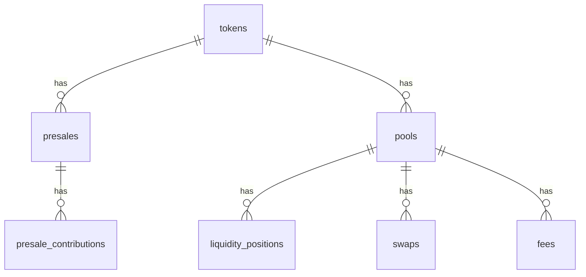

**TABLES**

---

# 📦 Tables

---

## 1. `tokens`

Store info about tokens launched or tracked on the DEX.

| Column         | Type            | Notes                    |
| -------------- | --------------- | ------------------------ |
| `id`           | `uuid` (PK)      | Internal ID              |
| `mint_address` | `text` (unique)  | Solana Mint Address      |
| `symbol`       | `text`           | Token Symbol (e.g., WIF) |
| `name`         | `text`           | Token Name (e.g., Dogwifhat) |
| `decimals`     | `integer`        | Token Decimals           |
| `logo_uri`     | `text` (nullable)| Optional logo URL        |
| `created_at`   | `timestamp`      | Record creation time     |
| `updated_at`   | `timestamp`      | Record update time       |

---

## 2. `presales`

Store presale info about tokens that are launching.

| Column            | Type                | Notes                  |
| ----------------- | ------------------- | ---------------------- |
| `id`              | `uuid` (PK)          | Internal ID            |
| `token_id`        | `uuid` (FK → tokens.id)` | Linked Token ID |
| `presale_address` | `text` (unique)      | Presale Pool PDA Address |
| `total_raised`    | `numeric`            | Total SOL/USDC raised   |
| `target_amount`   | `numeric`            | Target raise cap       |
| `start_time`      | `timestamp`          | Start Time             |
| `end_time`        | `timestamp`          | End Time               |
| `status`          | `enum('active', 'completed', 'cancelled')` | Current Presale Status |
| `created_at`      | `timestamp`          | Record creation time   |
| `updated_at`      | `timestamp`          | Record update time     |

---

## 3. `pools`

AMM pools for token-token swaps.

| Column         | Type              | Notes                  |
| -------------- | ----------------- | ---------------------- |
| `id`           | `uuid` (PK)        | Internal ID            |
| `pool_address` | `text` (unique)    | Pool PDA Address       |
| `token_a_id`   | `uuid` (FK → tokens.id)` | Token A             |
| `token_b_id`   | `uuid` (FK → tokens.id)` | Token B             |
| `lp_mint`      | `text`             | LP Token Mint Address  |
| `created_at`   | `timestamp`        | Record creation time   |
| `updated_at`   | `timestamp`        | Record update time     |

---

## 4. `liquidity_positions`

Track user-provided liquidity.

| Column          | Type               | Notes                     |
| --------------- | ------------------ | ------------------------- |
| `id`            | `uuid` (PK)         | Internal ID               |
| `user_wallet`   | `text`              | User's Solana wallet      |
| `pool_id`       | `uuid` (FK → pools.id)` | Linked Pool ID         |
| `amount_token_a`| `numeric`           | Amount of Token A         |
| `amount_token_b`| `numeric`           | Amount of Token B         |
| `lp_tokens`     | `numeric`           | Amount of LP tokens owned |
| `created_at`    | `timestamp`         | Record creation time      |
| `updated_at`    | `timestamp`         | Record update time        |

---

## 5. `swaps`

Swap history (for volume stats, analytics, charts).

| Column         | Type              | Notes                     |
| -------------- | ----------------- | ------------------------- |
| `id`           | `uuid` (PK)        | Internal ID               |
| `pool_id`      | `uuid` (FK → pools.id)` | Linked Pool ID         |
| `user_wallet`  | `text`             | Swapper's Solana wallet   |
| `amount_in`    | `numeric`          | Input token amount        |
| `amount_out`   | `numeric`          | Output token amount       |
| `token_in_id`  | `uuid` (FK → tokens.id)` | Token In ID           |
| `token_out_id` | `uuid` (FK → tokens.id)` | Token Out ID          |
| `tx_hash`      | `text` (unique)     | Transaction Signature     |
| `timestamp`    | `timestamp`         | Swap Timestamp            |

---

## 6. `fees`

Claimable trading fees for LPs.

| Column           | Type               | Notes                     |
| ---------------- | ------------------ | ------------------------- |
| `id`             | `uuid` (PK)         | Internal ID               |
| `pool_id`        | `uuid` (FK → pools.id)` | Linked Pool ID         |
| `user_wallet`    | `text`              | LP's Solana wallet        |
| `unclaimed_fee_a`| `numeric`           | Fee earned in Token A     |
| `unclaimed_fee_b`| `numeric`           | Fee earned in Token B     |
| `last_claimed_at`| `timestamp` (nullable) | Last claimed timestamp |

---

## 7. `presale_contributions`

Track each user's presale contribution.

| Column          | Type                | Notes                    |
| --------------- | ------------------- | ------------------------ |
| `id`            | `uuid` (PK)          | Internal ID              |
| `presale_id`    | `uuid` (FK → presales.id)` | Linked Presale ID   |
| `user_wallet`   | `text`               | Contributor's Solana wallet |
| `amount`        | `numeric`            | Amount contributed       |
| `timestamp`     | `timestamp`          | Contribution timestamp   |

---

# 📋 Entity Relationship Diagram (ERD)

---